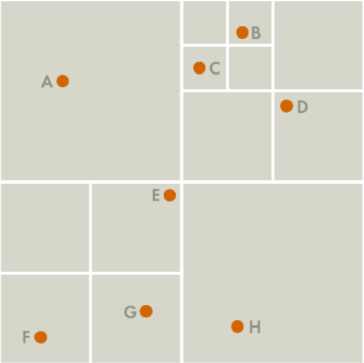
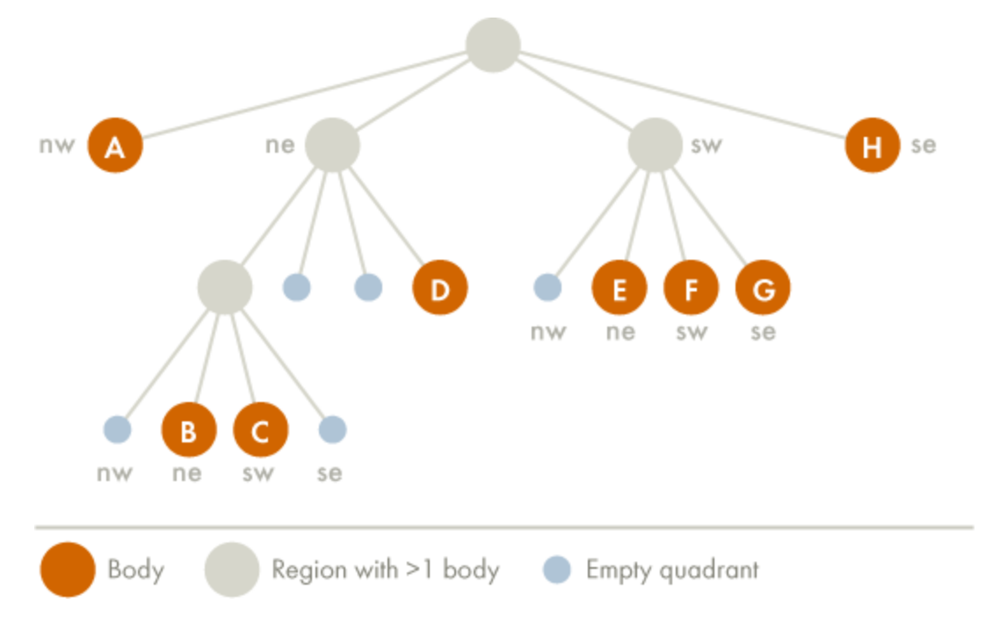

<!DOCTYPE html>
<html>
<head>
</head>
  <body>
    <h1> galaxyCollision </h1>
      
 This is a simulation of galaxy collisions! I have used Eulerian Integration to time step the N-bodies in the simulation and the Barnes-Hut Algorithm to optimize the time complexity of the N-body problem. A typical N-body problem is O(N^2), but with the Barnes-Hut Algorithm the complexity is O(Nlog(N)), allowing for many more bodies and a more realistic galactic collision 

     
    <h3> Barnes-Hut Algorithm </h3>
    
 The Barnes-Hut Algorithm is a clever scheme to group bodies that are close together and treat them as a single center of mass in order to make force calculations less intensive. It recursively divides the bodies in your system into groups by sorting them into a quad tree (like a binary tree, but with four child nodes instead of two). Each node in the Quad Tree represents a region in 2-Dimensional space. Below is a depiction of these Quadrants with bodies in them. "External Quadrants" are those that only have a single body in them. "Internal Quadrants" are those quadrants that refer to other quadrants, which may or may not have bodies in them.

    
    
 The image above can be nicely represented as a quad tree, seen below. 

    
     
    
 To calculate the net force on a particular body, traverse the nodes of the tree, starting from the root. If the center-of-mass of an internal node is sufficiently far from the body, approximate the bodies contained in that part of the tree as a single body, whose position is the group’s center of mass and whose mass is the group’s total mass. The algorithm is fast because we don’t need to individually examine any of the bodies in the group. 

    <h3> Contents </h3>
    <ul>
      <li> Objects File - This file defines the Body and Cell Classes. A Body object is a mass in the N-body system. A Cell object represents a quadrant in 2 dimensional space. It has the ability to self divide into child quadrants and populate itself with Body objects. </li>
      <li> Tree File - This file defines the Tree object, which has an "advance" method that populates all of the cells with bodies, calculates the net forces on each body according to the Barnes-Hut Algorithm and steps each body through time.</li>
      <li> Initialize File - This file sets the initial conditions for the bodies in the system. Currently, this simply initializes two black holes within the universe and uniformly distributes masses in a disk around them. There is no distribution of masses throughout the galaxy, each mass is simply a solar mass and the black holes are 4 million times a solar mass. The is initial rotational velocity of masses around the Black Holes, but no initial velocity of the galaxy itself. </li>
      <li> Driver File - This file runs the simulation for some duration and will eventually write the position output to a CSV file and animate the process</li> 
    </ul>
    <h3> Assumptions </h3>
    <h3> Future Improvements </h3>
  </body>
</html>
  
